# Hi 👋, I'm Nalin Angrish
I build systems software - the kind that sits close to the metal and has no room for failure.
 
As a student engineer at IIT Ropar, I'm already working at the deep end: I'm currently an AI Infra Intern at Nava, where I'm building components of a smart infrastructure platform that autonomously manages the entire cloud stack - with the goal of self-sustaining resilience at scale.
 
I work in Go, Python and C++. I think in systems. I care about the decisions that don't show up in the diff but determine whether a system holds together under pressure.
 
I also build drones and robots on the side - because I've always preferred problems where the software has real consequences.

## 🌐 Socials:

 
 

# 💻 Tech Stack:

 
 
 
 
 

 

 
 
 

# 📊 GitHub Stats:

